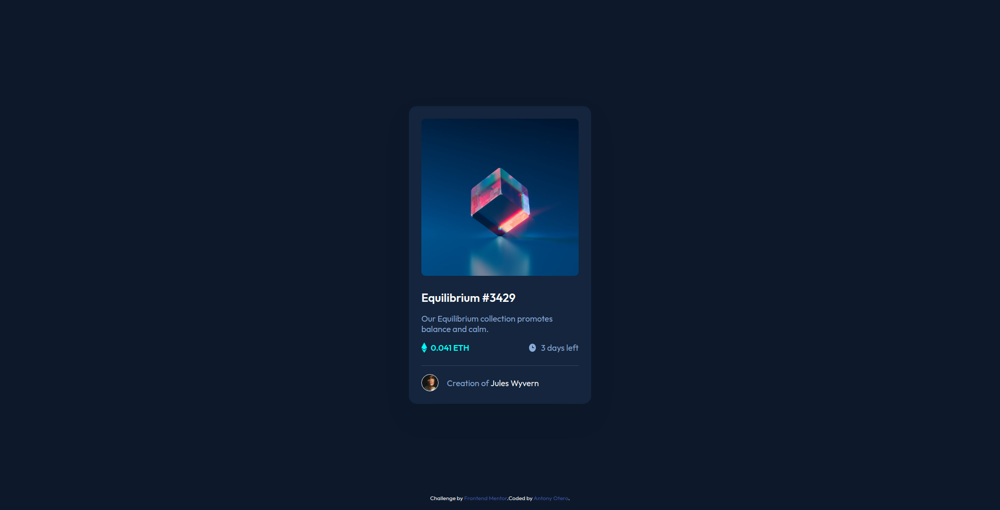

# Frontend Mentor - NFT preview card component solution

This is a solution to the [NFT preview card component challenge on Frontend Mentor](https://www.frontendmentor.io/challenges/nft-preview-card-component-SbdUL_w0U). Frontend Mentor challenges help you improve your coding skills by building realistic projects. 

## Table of contents

- [Overview](#overview)
  - [The challenge](#the-challenge)
  - [Screenshot](#screenshot)
  - [Links](#links)
- [My process](#my-process)
  - [Built with](#built-with)
  - [What I learned](#what-i-learned)
  - [Continued development](#continued-development)
  - [Useful resources](#useful-resources)
- [Author](#author)

## Overview

### The challenge

Users should be able to:

- View the optimal layout depending on their device's screen size
- See hover states for interactive elements

### Screenshot



### Links

- Solution URL: [https://antonyotero.github.io/nft-preview-card-component-main/](https://antonyotero.github.io/nft-preview-card-component-main/)
- Live Site URL: [https://github.com/AntonyOtero/nft-preview-card-component-main](https://github.com/AntonyOtero/nft-preview-card-component-main)

## My process

### Built with

- Semantic HTML5 markup
- CSS custom properties
- Flexbox
- CSS Grid

### What I learned

While this project was small-scale and simple, I was challenged a bit by trying to display an overlay on hover. When a user hovers their cursor over the image, an overlay should appear with an icon of an eye to suggest the user can view the image.

To accomplish this effect, I created a `<div>` parent element to contain three other elements. The first element is the image, the second is the overlay, and the third is the eye icon.
```html
<div class="card_image-container">
  <div class="overlay"></div>
  
  
</div>
```

The effect itself is achieved by using the parent `div` element's `:hover` pseudo-class to change the opacity of the overlay and eye icon.
```css
.overlay,
.icon-view {
  position: absolute; /* The parent is set to position relative */
  opacity: 0;
}

.overlay {
  width: 302px;
  height: 302px;
  top: 0;
  left: 0;
  background: var(--color-primary);
  border-radius: 8px; 
}

.icon-view {
  top: 50%;
  left: 50%;
  transform: translate(-50%, -50%);
  color: var(--color-white);
}

.image-container:hover .overlay {
  opacity: 0.5;
}

.image-container:hover .icon-view {
  opacity: 0.75;
}
```

### Continued development

I want to continue learning more about writing semantic HTML5 markup, coming up with good CSS class names, and using both [Flexbox](https://developer.mozilla.org/en-US/docs/Web/CSS/CSS_Flexible_Box_Layout/Basic_Concepts_of_Flexbox) and [CSS Grid](https://developer.mozilla.org/en-US/docs/Web/CSS/CSS_Grid_Layout) for responsive layouts.

### Useful resources

- [DevDocs](https://devdocs.io/) - DevDocs combines multiple API documentations in a fast, organized, and searchable interface.
- [MDN](https://developer.mozilla.org/en-US/) - Resources for developers, by developers.

## Author

- Website - [AntonyOtero](https://github.com/AntonyOtero)
- Frontend Mentor - [@AntonyOtero](https://www.frontendmentor.io/profile/AntonyOtero)
- Twitter - [@AntonyOtero](https://twitter.com/AntonyOtero)
